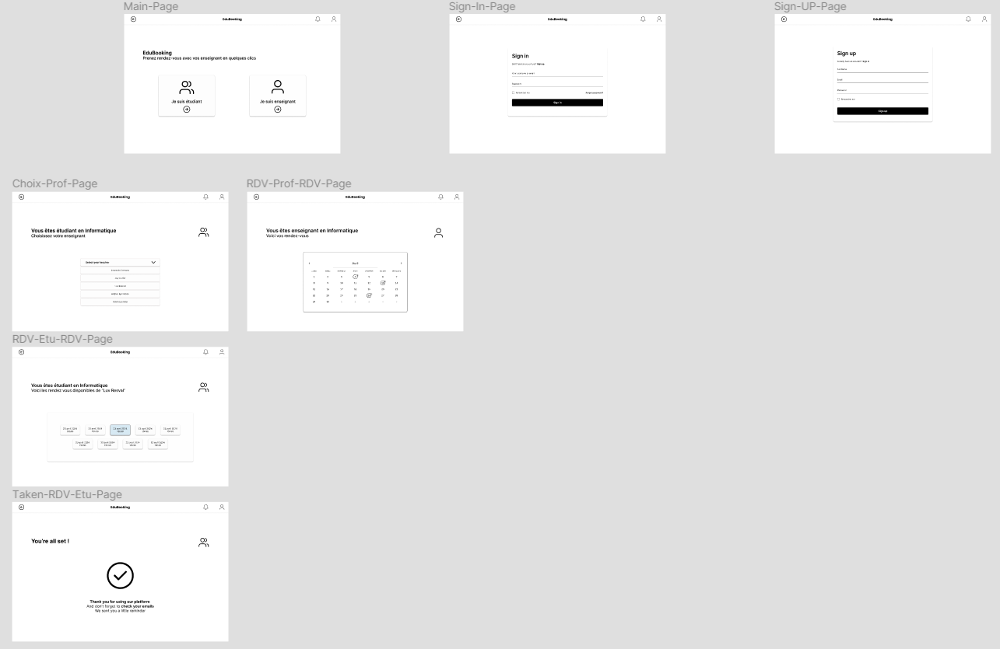
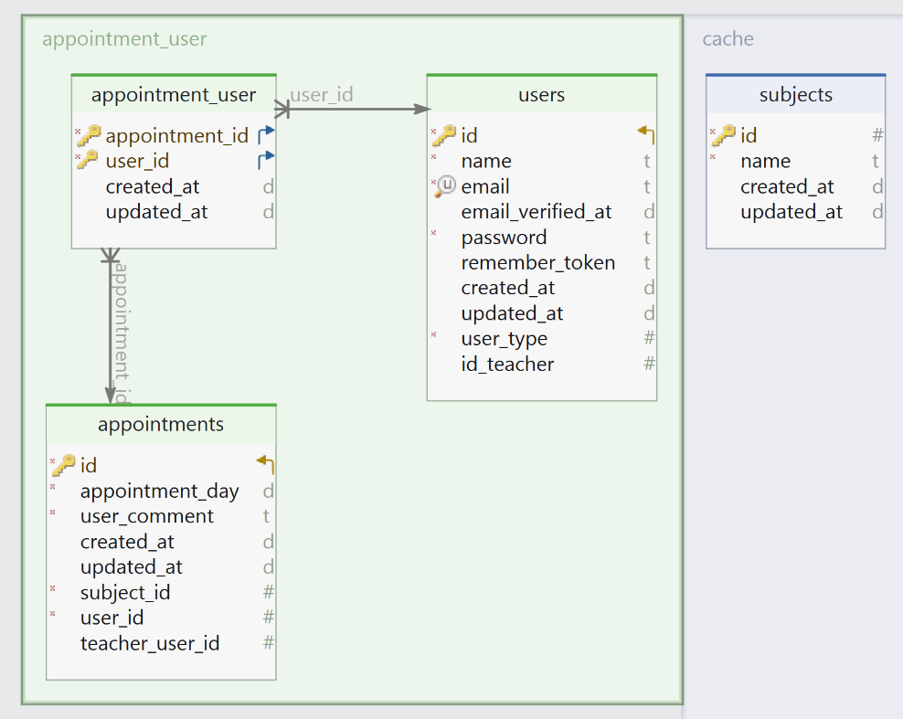

# EduBooking


-orange)
-blue)


EduBooking is an innovative online appointment scheduling platform designed to facilitate seamless interactions between students and teachers. This tool allows students to book appointments with their educators effortlessly, enhancing the educational experience by fostering easier and more direct communication.

## Table of Contents

- [Project Overview](#project-overview)
- [Features](#features)
- [Technology Stack](#technology-stack)
- [Getting Started](#getting-started)
- [Project Wireframe and DB Schema](#project-wireframe-and-db-schema)
- [Contributors](#contributors)
- [Timeline](#timeline)

## Project Overview

EduBooking simplifies the process of scheduling meetings by providing a user-friendly interface where students can find available timeslots and book appointments with teachers. The platform aims to minimize administrative overhead and maximize interaction time between students and educators.

## Features

- [X] **User Authentication:** Secure login and registration system for teachers and students.
- [X] **Appointment Booking:** Students can choose their teacher, view their availability, and book slots accordingly.
- [X] **Dashboard:** Customized dashboards for students and teachers to manage appointments.
- [ ] **Email Notification:** An email will be sent automatically to remind you of the date and time of your appointment.

## Technology Stack

| **Back-end Framework:** 🛠️ | [Laravel](https://laravel.com/) |
|:---------------------------|:-------------------------------:|
| **Programming Languages:** ✍🏻 | PHP, HTML (Blade templates), CSS |
| **Database:** 📦             | SQLite                          |

## Getting Started

To get a local copy up and running, follow these simple steps:

```bash
git clone https://github.com/your-username/eduBooking.git
cd eduBooking
composer install
cp .env.example .env
php artisan key:generate
php artisan migrate
php artisan serve
```

## Project Wireframe and DB Schema

#### Overview

Here is the wireframe that outlines the design and structure of our application. You can view a static image below or visit the interactive version on Figma for more detailed exploration.

#### Wireframe Image



#### Interactive Version

[View Wireframe on Figma](https://www.figma.com/file/7uCx0zqfxcI8853Z9kyoHf/Projet-B2-DEV?type=design&node-id=0-1&mode=design&t=acMQupP4mp7VBsdG-0)

#### DB Schema



## Contributors

- **Etienne Lemée** - Project Manager and Creator, Fullstack Developer, Project Organisation, Database Management, Documentation.
- **Lenny Olax-Bargain** - Frontend Developer.
- **Anas Rayk** - Frontend Developer.

## Timeline

- **Project Start Date:** April 16, 2024
- **Expected Completion:** April 30, 2024
- **Total Class Sessions:** 7
- **Ongoing updates post-completion**
